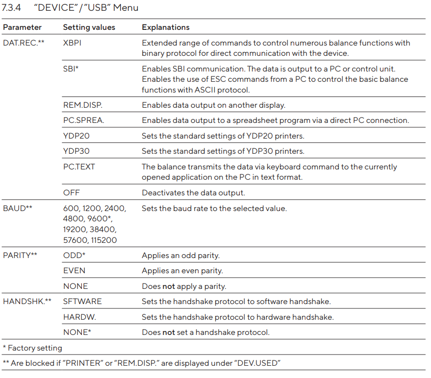

.. _alt-textlogo:

|alt text|
==========

Project: Sartorius Scale Interface
----------------------------------

**Contact:** Noah & Jacob

**Description:** Repository for interfacing with the Sartorius Scale.
There are two (2) different types of interfaces that we have to
communicated with the Sartorius Scale. The first is a USB type A and the
second is a USB type C.

-  Link to: `Sartorius
   Documentation <documents\sartorius-entris-user-manual.pdf>`__

Serial_type_a_usb.py
~~~~~~~~~~~~~~~~~~~~

::

   Sartorius Scale Name - ENTRIS323-1S
   S/N - 34309393
   USB - Serial Port 9 pin to 25 pin adapter

   Communication Information
   -------------------------
   Baud Rate - 19200
   Parity - None
   Stop Bits - 1
   Handshake - None
   Data Bits - 8
   Data.Rec - Printer

Serial_type_c_usb.py
~~~~~~~~~~~~~~~~~~~~

::

   Sartorius Scale Name - BCE323-1S
   S/N - 0041702376
   USB - USB-c to USB-c

   Communication Information
   -------------------------
   Baud Rate - 115200
   Parity - ODD
   Stop Bits - 
   Handshake - None
   Data Bits - 8 bits 
   Data.Rec - SBI

.. _alt-textmenu:

|image1|
========

Git Useful Commands
-------------------

::

   git add .
   git commit -m "message"
   git push origin master
   git pull origin master

Opening a Terminal in VS Code
-----------------------------

::

   Ctrl + Shift + `

Reading from the serial port
----------------------------

::

   def main():
   ser = connect()
   ser.write(zero)
   ser.write(sound)

   while(True):
       for line in ser.read():
           print(chr(line))

